# Lombda.StateMachine

A powerful and flexible state machine library for .NET 8.0 that supports concurrent execution, complex state transitions, and type-safe operations. This library provides both generic and non-generic state machine implementations with extensive event handling and logging capabilities.

## Features

- **Generic and Non-Generic State Machines**: Support for both strongly-typed and object-based state machines
- **Concurrent Execution**: Built-in thread management with configurable thread limits
- **Flexible State Transitions**: Conditional state transitions with support for data transformation
- **Event-Driven Architecture**: Comprehensive event system for monitoring state machine execution
- **Lambda State Support**: Easy integration of lambda functions as states
- **Cancellation Support**: Graceful cancellation and cleanup mechanisms
- **Runtime Properties**: Persistent storage for state machine runtime data
- **Step Recording**: Optional execution step recording for debugging and analysis
- **Async/Await Support**: Full asynchronous operation support throughout the library
- **🆕 State Machine Visualization**: Generate Graphviz DOT and PlantUML diagrams for visual documentation

## Installation

Add the project reference to your solution or include the source files directly in your project.

## Quick Start

### Creating State Machines

States essentially transforms the Input into the Output

Where `FooState : BaseState<InputType, OutputType>`

Invoke(InputType input) Must Return the Output Type (Strongly Typed)

You can only Transition to a state where the Output of the current state is the Input to the next state
```csharp
class ConvertStringToIntState : BaseState<string, int>
{
    public override async Task<int> Invoke(string input)
    {
        return int.Parse(this.Input)
    }
}
```

You can build pipelines of states and let the agent transition between them based on the results.

### Creating State Machines With Input & Output Types
```csharp
//Where string is Input and int is Output
StateMachine<string, int> stateMachine = new();

//Set start state with string Input
stateMachine.SetEntryState(inputState);

//Set state where output is
stateMachine.SetOutputState(resultState);

//Return list of Output objects from State 
//List because machine might generate more than 1 output depending on flow
List<int> stateResults = await stateMachine.Run("3");---
```
### Allow states to transition to other states in a parallel workflow 
```csharp
//AllowsParallelTransitions = true Allows state Outputs to transition to all states that meet the criteria
ConvertStringToIntState inputState = new() { AllowsParallelTransitions = true };

IntPlus3State state3 = new();
IntPlus4State state4 = new();

//CombineInput = true only does 1 execution reguardless of # of Inputs
//Handle all of the Inputs
SummingState summingState = new() { CombineInput = true };
ConvertIntToStringState resultState = new();

//should happen in parallel and get result
inputState.AddTransition(state3);
inputState.AddTransition(state4);

//summing State will get both results next tick
state3.AddTransition(summingState);
state4.AddTransition(summingState);

//Will sum all inputs 
summingState.AddTransition(resultState);

//Convert result and End the State Machine 
resultState.AddTransition(new ExitState());

//Create Input & Output State Machine
StateMachine<string, string> stateMachine = new();

//Define Entry and Output States
stateMachine.SetEntryState(inputState);
stateMachine.SetOutputState(resultState);

//Run the StateMachine
List<string?> stateResults = await stateMachine.Run("3");
```

### Simple Conversion from different Input to Output types

```csharp
ConvertStringToIntState inputState = new();
ConvertStringToIntState resultState = new();

//Input State will convert string to int
inputState.AddTransition((result) => result.ToString(), resultState);

resultState.AddTransition(new ExitState());

StateMachine<string, int?> stateMachine = new();

stateMachine.SetEntryState(inputState);
stateMachine.SetOutputState(resultState);

var stateResults = await stateMachine.Run(["3","2","4"]);

Console.WriteLine($"State Results: {string.Join(", ", stateResults.Select(r => string.Join(", ", r)))}");

Assert.IsTrue(stateResults[0].Contains(3));
```

## State Machine Visualization

This library includes built-in support for generating visual diagrams of your state machines in two popular formats:

### Graphviz DOT Format
Generate professional diagrams using Graphviz:

```csharp
// Create and configure your state machine
var stateMachine = new StateMachine<string, string>();
// ... add states and transitions ...

// Generate DOT format
string dotGraph = stateMachine.ToDotGraph("MyStateMachine");
Console.WriteLine(dotGraph);

// Save to file and render
await File.WriteAllTextAsync("statemachine.dot", dotGraph);
// Render with: dot -Tpng statemachine.dot -o statemachine.png
```

### PlantUML Format
Generate UML state diagrams using PlantUML:

```csharp
// Generate PlantUML format
string plantUml = stateMachine.ToPlantUML("My State Machine");
Console.WriteLine(plantUml);

// Save to file and render
await File.WriteAllTextAsync("statemachine.puml", plantUml);
// Render online at: http://www.plantuml.com/plantuml/
```

### Example Output

**Graphviz DOT:**

```dot
digraph MyStateMachine {
    rankdir=LR;
    node [shape=rectangle, style=filled, fillcolor=lightblue];

    StartState [fillcolor=lightgreen, label="StartState\n(string → int)\n(Start)"];
    ProcessState [fillcolor=lightblue, label="ProcessState\n(int → string)"];
    EndState [fillcolor=lightcoral, label="EndState\n(string → string)\n(Result)"];
    
    StartState -> ProcessState [label="condition"];
    ProcessState -> EndState [label="condition"];
}
```


**PlantUML:**


For complete visualization documentation, see [VISUALIZATION.md](VISUALIZATION.md).

## API Reference

### StateMachine Class
```csharp
public class StateMachine
{
    // Properties
    public int MaxThreads { get; set; }
    public bool RecordSteps { get; set; }
    public bool IsFinished { get; set; }
    public ConcurrentDictionary<string, object> RuntimeProperties { get; set; }
    public List<StateProcess> ActiveProcesses { get; }
    public CancellationToken CancelToken { get; }

    // Events
    public event Action OnBegin;
    public event Action OnTick;
    public event Action<StateProcess>? OnStateEntered;
    public event Action<BaseState>? OnStateExited;
    public event Action<StateProcess>? OnStateInvoked;
    public event Action? FinishedTriggered;
    public event Action? CancellationTriggered;
    public event Action<string>? VerboseLog;

    // Methods
    public async Task Run(BaseState runStartState, object? input = null);
    public void Stop();
    public void Finish();
    public void ResetRun();
}
```

### StateMachine<TInput, TOutput> Class
```csharp
public class StateMachine<TInput, TOutput> : StateMachine
{
    // Properties
    public List<TOutput>? Results { get; }
    public BaseState StartState { get; set; }
    public BaseState ResultState { get; set; }

    // Methods
    public async Task<List<TOutput?>> Run(TInput input);
    public async Task<List<List<TOutput?>>> Run(TInput[] inputs);
    public void SetEntryState(BaseState startState);
    public void SetOutputState(BaseState resultState);
}
```

### Visualization Extensions
```csharp
public static class StateMachineVisualization
{
    // Extension methods for both StateMachine and StateMachine<TInput, TOutput>
    public static string ToDotGraph(this StateMachine stateMachine, string graphName = "StateMachine");
    public static string ToDotGraph<TInput, TOutput>(this StateMachine<TInput, TOutput> stateMachine, string graphName = "StateMachine");
    public static string ToPlantUML(this StateMachine stateMachine, string title = "State Machine");
    public static string ToPlantUML<TInput, TOutput>(this StateMachine<TInput, TOutput> stateMachine, string title = "State Machine");
}
```

## Contributing

When contributing to this project:

1. Follow the existing code style and patterns
2. Add comprehensive unit tests for new functionality
3. Update documentation for public API changes
4. Ensure all tests pass before submitting

## License

This project is available under the terms specified in the project license.

## Changelog

### Version 1.1.0
- **🆕 State Machine Visualization**: Added support for generating Graphviz DOT and PlantUML diagrams
- **New Features**:
  - `ToDotGraph()` extension method for Graphviz DOT format generation
  - `ToPlantUML()` extension method for PlantUML state diagram generation
  - Automatic state coloring (start states, result states, dead-end states)
  - Type information display in state labels
  - Special character sanitization for diagram compatibility
  - Support for complex state machines with multiple transitions
- **Documentation**: Added comprehensive visualization guide and examples

### Version 1.0.0
- Initial release with core state machine functionality
- Generic and non-generic implementations
- Comprehensive event system
- Thread management and cancellation support
- Full test coverage