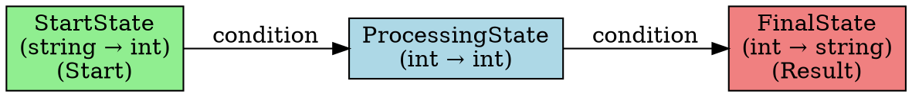
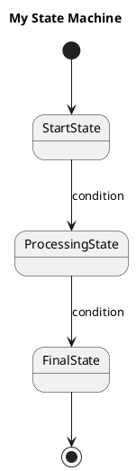

# State Machine Visualization

This library now includes built-in support for visualizing state machines using two popular formats:

- **Graphviz DOT format** - For creating professional diagrams with Graphviz
- **PlantUML format** - For creating diagrams with PlantUML

## Features

### Extension Methods

The visualization functionality is provided through extension methods on both `StateMachine` and `StateMachine<TInput, TOutput>` classes:

- `ToDotGraph(string graphName = "StateMachine")` - Generates Graphviz DOT format
- `ToPlantUML(string title = "State Machine")` - Generates PlantUML state diagram syntax

### Visual Elements

The generated diagrams include:

- **State boxes** with type information (input → output types)
- **Transitions** with condition labels
- **Special state highlighting**:
  - Start states (light green background)
  - Result states (light coral background)  
  - Dead-end states (light gray background)
- **State properties** like "Dead End State" annotations

## Usage Examples

### Basic Usage

```csharp
using Lombda.StateMachine;

// Create your state machine
var stateMachine = new StateMachine<string, string>();
// ... configure states and transitions ...

// Generate Graphviz DOT format
var dotGraph = stateMachine.ToDotGraph("MyStateMachine");
Console.WriteLine(dotGraph);

// Generate PlantUML format
var plantUml = stateMachine.ToPlantUML("My State Machine");
Console.WriteLine(plantUml);
```

### Complete Example

```csharp
// Create states
var startState = new StringToIntState();
var processingState = new MultiplyByTwoState();
var finalState = new IntToStringState() { IsDeadEnd = true };

// Set up transitions
startState.AddTransition(processingState);
processingState.AddTransition(result => result > 10, finalState);

// Configure state machine
var stateMachine = new StateMachine<string, string>();
stateMachine.SetEntryState(startState);
stateMachine.SetOutputState(finalState);
stateMachine.States.Add(startState);
stateMachine.States.Add(processingState);
stateMachine.States.Add(finalState);

// Generate visualizations
var dot = stateMachine.ToDotGraph("ProcessingWorkflow");
var puml = stateMachine.ToPlantUML("Processing Workflow");

// Save to files
await File.WriteAllTextAsync("workflow.dot", dot);
await File.WriteAllTextAsync("workflow.puml", puml);
```

## Output Formats

### Graphviz DOT Format

The generated DOT format creates directed graphs with:



### PlantUML Format

The generated PlantUML format creates state diagrams with:



## Rendering the Diagrams

### Graphviz

To render DOT files with Graphviz:

```bash
# Install Graphviz (varies by platform)
# Ubuntu/Debian: sudo apt-get install graphviz
# macOS: brew install graphviz
# Windows: Download from https://graphviz.org/download/

# Render to PNG
dot -Tpng state_machine.dot -o state_machine.png

# Render to SVG
dot -Tsvg state_machine.dot -o state_machine.svg

# Render to PDF
dot -Tpdf state_machine.dot -o state_machine.pdf
```

### PlantUML

To render PlantUML files:

```bash
# Install PlantUML
# Download plantuml.jar from https://plantuml.com/download

# Render diagram
java -jar plantuml.jar state_machine.puml

# Or use online editor
# http://www.plantuml.com/plantuml/
```

## Integration with CI/CD

You can integrate diagram generation into your build process:

```yaml
# GitHub Actions example
- name: Generate State Machine Diagrams
  run: |
    dotnet run --project YourProject -- --generate-diagrams
    dot -Tpng *.dot
    
- name: Upload Diagrams
  uses: actions/upload-artifact@v3
  with:
    name: state-machine-diagrams
    path: "*.png"
```

## Advanced Features

### Custom State Colors

The visualization automatically applies colors based on state properties:

- **Start states**: Light green background
- **Result states**: Light coral background
- **Dead-end states**: Light gray background
- **Regular states**: Light blue background

### Transition Labels

Transitions are automatically labeled based on their type:

- **Conditional transitions**: "condition"
- **Conversion transitions**: "convert"
- **Always transitions**: No label

### Type Information

State labels include input and output type information:

```
StateName
(InputType → OutputType)
```

Complex generic types are automatically simplified and sanitized for display.

## API Reference

### StateMachine Extensions

```csharp
public static string ToDotGraph(this StateMachine stateMachine, string graphName = "StateMachine")
public static string ToDotGraph<TInput, TOutput>(this StateMachine<TInput, TOutput> stateMachine, string graphName = "StateMachine")
public static string ToPlantUML(this StateMachine stateMachine, string title = "State Machine")
public static string ToPlantUML<TInput, TOutput>(this StateMachine<TInput, TOutput> stateMachine, string title = "State Machine")
```

### Parameters

- **graphName**: Name used for the DOT graph (must be valid DOT identifier)
- **title**: Title displayed in the PlantUML diagram

### Return Values

Both methods return string representations that can be:
- Saved to files
- Sent to rendering tools
- Embedded in documentation
- Used in automated testing

## Troubleshooting

### Common Issues

1. **Missing transitions**: Ensure all states are added to the `States` collection
2. **Type display issues**: Complex generic types are automatically sanitized
3. **DOT syntax errors**: State names with special characters are automatically escaped
4. **Empty diagrams**: Check that states have transitions configured

### Debugging

Enable verbose logging to see what states and transitions are being processed:

```csharp
stateMachine.VerboseLog += message => Console.WriteLine($"[SM] {message}");
```